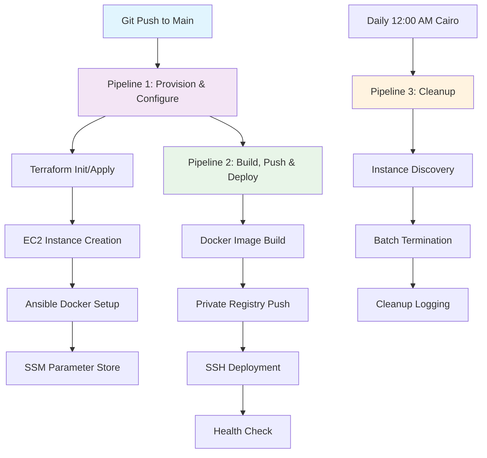

# 🚀 CI/CD Pipeline Mastery: Jenkins + Terraform + Ansible + Docker

[](#pipeline-architecture)
[](#infrastructure-as-code)
[](#configuration-management)
[](#containerization)
[](#automation)

> **A production-ready CI/CD pipeline that demonstrates enterprise-level DevOps practices with ephemeral infrastructure, automated deployments, and intelligent cleanup mechanisms.**
 
---

## 🎯 Project Overview

This repository showcases a sophisticated **3-stage CI/CD pipeline** that epitomizes modern DevOps practices. Built for the **Konecta CI/CD Practical Task**, it demonstrates how to orchestrate infrastructure provisioning, application deployment, and automated cleanup using industry-standard tools.

### 🌟 What Makes This Special?

- **🔄 Ephemeral Infrastructure**: Auto-provisioned and auto-destroyed EC2 instances
- **🏗️ Infrastructure as Code**: Terraform with remote state management
- **⚙️ Configuration Management**: Ansible for consistent server setup
- **🐳 Container Orchestration**: Docker with private registry integration
- **⏰ Intelligent Scheduling**: Timezone-aware cleanup automation
- **🔐 Security First**: Zero secrets in code, Jenkins credentials management
- **📊 Multi-Level Documentation**: Beginner to expert explanations

---

## 🏗️ Pipeline Architecture



---

## 📁 Repository Structure

```
CI-CD-Practical-Task/
├── 📋 Jenkinsfile.provision    # Pipeline 1: Infrastructure provisioning
├── 🚀 Jenkinsfile.deploy       # Pipeline 2: Application deployment  
├── 🧹 Jenkinsfile.cleanup      # Pipeline 3: Automated cleanup
├── 🏗️ terraform/               # Infrastructure as Code
│   ├── main.tf                 # Core infrastructure resources
│   ├── variables.tf            # Configurable parameters
│   ├── outputs.tf              # Resource outputs
│   └── backend.tf              # Remote state configuration
└── ⚙️ ansible/                 # Configuration management
    └── playbook.yml            # Docker installation automation
```

---

## 🚀 Quick Start Guide

### For Beginners 👶

**What you'll learn:**
- Basic CI/CD concepts
- Infrastructure automation
- Container deployment
- Automated cleanup

**Prerequisites:**
- AWS Account (Free Tier)
- Jenkins Server
- Basic command line knowledge

**Setup Steps:**
1. **Clone the repository**
   ```bash
   git clone <your-repo-url>
   cd CI-CD-Practical-Task
   ```

2. **Configure Jenkins Credentials**
   - `aws-creds`: AWS Access Key & Secret
   - `docker-hub-creds`: Docker Hub username & password
   - `JENKINS_PEM`: EC2 SSH private key
   - `JenkinsCleanup`: AWS credentials for cleanup

3. **Create Jenkins Jobs**
   - **Provision Job**: Use `Jenkinsfile.provision`
   - **Deploy Job**: Use `Jenkinsfile.deploy`
   - **Cleanup Job**: Use `Jenkinsfile.cleanup` (schedule: `TZ=Africa/Cairo 0 0 * * *`)

4. **Trigger the Pipeline**
   - Push to main branch
   - Watch the magic happen! ✨

### For Intermediate Users 🔧

**Advanced Configuration:**

**Terraform Backend Setup:**
```bash
# Create S3 bucket for state
aws s3 mb s3://your-terraform-state-bucket

# Create DynamoDB table for locking
aws dynamodb create-table \
  --table-name terraform-locks \
  --attribute-definitions AttributeName=LockID,AttributeType=S \
  --key-schema AttributeName=LockID,KeyType=HASH \
  --provisioned-throughput ReadCapacityUnits=5,WriteCapacityUnits=5
```

**Custom Variables:**
```hcl
# terraform/variables.tf
variable "aws_region" {
  description = "AWS region for deployment"
  type        = string
  default     = "us-east-1"
}

variable "instance_type" {
  description = "EC2 instance type"
  type        = string
  default     = "t2.micro"
}
```

**Pipeline Customization:**
- Modify Docker image tags
- Adjust retry mechanisms
- Customize cleanup schedules
- Add notification integrations

### For Experts 🧠

**Enterprise Enhancements:**

**1. Multi-Environment Support:**
```groovy
// Jenkinsfile.provision
environment {
    ENVIRONMENT = params.ENVIRONMENT ?: 'dev'
    AWS_REGION = params.AWS_REGION ?: 'us-east-1'
}
```

**2. Advanced Security:**
```yaml
# ansible/playbook.yml
- name: Configure security groups
  ec2_group:
    name: "ci-ephemeral-sg"
    description: "Security group for CI instances"
    rules:
      - proto: tcp
        ports: [22, 80, 443]
        cidr_ip: 0.0.0.0/0
```

**3. Monitoring Integration:**
```groovy
// Add to Jenkinsfile.deploy
stage('Health Check & Monitoring') {
    steps {
        sh """
            # CloudWatch metrics
            aws cloudwatch put-metric-data \
                --namespace "CI/CD" \
                --metric-data MetricName=DeploymentSuccess,Value=1,Unit=Count
        """
    }
}
```

**4. Blue-Green Deployment:**
```bash
# Advanced deployment strategy
docker run -d --name web-green -p 8080:80 $IMAGE_NAME:$TAG
# Health check
# Switch traffic
# Remove old container
```

---

## 🔧 Technical Deep Dive

### Pipeline 1: Provision & Configure

**Trigger:** Git webhook on push to main
**Purpose:** Create ephemeral infrastructure and configure it

**Key Features:**
- **Remote State Management**: S3 + DynamoDB for state locking
- **Instance Tagging**: Strategic tagging for lifecycle management
- **SSM Integration**: IP storage for pipeline handoff
- **Retry Logic**: Robust error handling and retry mechanisms

**Terraform Resources:**
```hcl
resource "aws_instance" "ci_ephemeral" {
  ami                         = data.aws_ami.amazon_linux.id
  instance_type               = var.instance_type
  associate_public_ip_address = true
  key_name                    = "Jenkins"
  tags = {
    Name     = "ci-ephemeral"
    lifespan = "ephemeral"
    owner    = "jenkins"
  }
}
```

### Pipeline 2: Build, Push & Deploy

**Trigger:** Automatic after Pipeline 1 completion
**Purpose:** Build, containerize, and deploy application

**Key Features:**
- **Dynamic Image Tagging**: Build number + timestamp
- **Private Registry**: Secure Docker Hub integration
- **SSH Deployment**: Automated container deployment
- **Health Verification**: Automated testing

**Docker Build Process:**
```dockerfile
FROM nginx:alpine
COPY index.html /usr/share/nginx/html/index.html
```

### Pipeline 3: Daily Cleanup

**Trigger:** Cron schedule (12:00 AM Africa/Cairo)
**Purpose:** Automated resource cleanup

**Key Features:**
- **Timezone Awareness**: Cairo timezone scheduling
- **Batch Operations**: Efficient bulk termination
- **Comprehensive Filtering**: Multiple state handling
- **Audit Logging**: Complete operation tracking

**Cleanup Logic:**
```bash
aws ec2 describe-instances \
  --filters "Name=tag:lifespan,Values=ephemeral" \
            "Name=instance-state-name,Values=pending,running,stopping,stopped" \
  --query "Reservations[*].Instances[*].InstanceId" \
  --output text
```

---

## 🛡️ Security Best Practices

### Credential Management
- **Zero Secrets in Code**: All sensitive data in Jenkins credentials
- **Least Privilege**: Minimal AWS permissions for each operation
- **Key Rotation**: Regular credential updates
- **Encrypted Storage**: S3 bucket encryption for state files

### Network Security
- **SSH Key Management**: Secure key distribution
- **Security Groups**: Minimal port exposure
- **VPC Configuration**: Network isolation
- **HTTPS Only**: Secure communication protocols

---

## 📊 Monitoring & Observability

### Built-in Monitoring
- **Pipeline Status**: Jenkins build status tracking
- **Resource Metrics**: EC2 instance monitoring
- **Deployment Verification**: Automated health checks
- **Cleanup Logging**: Comprehensive audit trails

### Recommended Additions
- **CloudWatch Integration**: Custom metrics and alarms
- **Slack Notifications**: Real-time pipeline updates
- **Grafana Dashboards**: Visual monitoring
- **ELK Stack**: Centralized logging

---

## 🚨 Troubleshooting Guide

### Common Issues

**1. Terraform State Lock**
```bash
# Solution: Force unlock (use with caution)
terraform force-unlock <lock-id>
```

**2. SSH Connection Timeout**
```bash
# Check security groups
aws ec2 describe-security-groups --group-ids <sg-id>

# Verify instance status
aws ec2 describe-instances --instance-ids <instance-id>
```

**3. Docker Login Failure**
```bash
# Test credentials
echo $DOCKER_PASS | docker login -u $DOCKER_USER --password-stdin
```

**4. Cleanup Not Working**
```bash
# Manual cleanup
aws ec2 terminate-instances --instance-ids <instance-id>
```

---

## 🎓 Learning Outcomes

### Beginner Level
- Understanding CI/CD concepts
- Basic infrastructure automation
- Container fundamentals
- Jenkins pipeline basics

### Intermediate Level
- Advanced Terraform patterns
- Ansible playbook development
- Docker registry management
- Pipeline orchestration

### Expert Level
- Enterprise security patterns
- Scalable architecture design
- Advanced monitoring strategies
- Performance optimization

---

## 🤝 Contributing

We welcome contributions! Here's how to get started:

1. **Fork the repository**
2. **Create a feature branch**: `git checkout -b feature/amazing-feature`
3. **Commit your changes**: `git commit -m 'Add amazing feature'`
4. **Push to the branch**: `git push origin feature/amazing-feature`
5. **Open a Pull Request**

### Contribution Guidelines
- Follow existing code style
- Add tests for new features
- Update documentation
- Ensure all pipelines pass

---

## 📈 Future Enhancements

### Planned Features
- [ ] **Multi-Cloud Support**: Azure and GCP integration
- [ ] **Kubernetes Deployment**: Container orchestration
- [ ] **Advanced Monitoring**: Prometheus + Grafana
- [ ] **Security Scanning**: SAST/DAST integration
- [ ] **Performance Testing**: Load testing automation

### Roadmap
- **Q1 2024**: Multi-environment support
- **Q2 2024**: Advanced security features
- **Q3 2024**: Performance optimization
- **Q4 2024**: Enterprise features

---

## 📚 Additional Resources

### Documentation
- [Jenkins Pipeline Documentation](https://www.jenkins.io/doc/book/pipeline/)
- [Terraform AWS Provider](https://registry.terraform.io/providers/hashicorp/aws/latest)
- [Ansible AWS Modules](https://docs.ansible.com/ansible/latest/collections/amazon/aws/)
- [Docker Best Practices](https://docs.docker.com/develop/dev-best-practices/)

### Training Materials
- [AWS Free Training](https://aws.amazon.com/training/)
- [Jenkins University](https://www.jenkins.io/doc/)
- [Terraform Learn](https://learn.hashicorp.com/terraform)
- [Ansible Galaxy](https://galaxy.ansible.com/)

---

## 📄 License

This project is licensed under the MIT License - see the [LICENSE](LICENSE) file for details.

---

## 🙏 Acknowledgments

- **Konecta Team** for the challenging practical task
- **HashiCorp** for Terraform
- **Red Hat** for Ansible
- **Docker Inc.** for containerization
- **Jenkins Community** for continuous integration

---

## 📞 Support

Having issues? We're here to help!

- **Create an Issue**: [GitHub Issues](https://github.com/your-repo/issues)
- **Join Discussions**: [GitHub Discussions](tarekadel314@gmail.com)
- **Contact**: [your-email@example.com](https://www.linkedin.com/in/tarek-adel-857279197/)

---

<div align="center">

**⭐ Star this repository if you found it helpful!**

[](https://github.com/your-username/CI-CD-Practical-Task)
[](https://github.com/your-username/CI-CD-Practical-Task)

*Built with ❤️ for the DevOps community*

</div>
